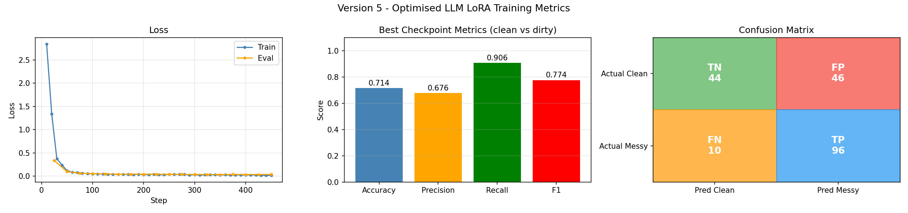
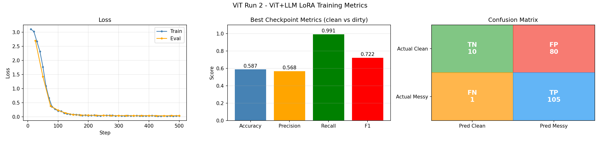

# roomaudit — project log

## The data problem

The obvious first instinct was to find an existing dataset. I looked at:

- **Hotels-50K** — the images weren't suitable, wrong kind of content
- **Places365** — too low resolution, wouldn't survive inpainting
- **Booking.com scraping** — ToS violation, and hard to find many suitable images 
- **Flickr** — manually browsed but requires a Pro account ($8/month) to download in bulk, not worth it

Eventually settled on manually downloading from **Unsplash**, **Pexels**, and **Flickr** (individual downloads). Ended up with 218 clean hotel room images.

---

## Approach

Since there's no messy room data, the plan is to generate it synthetically:

1. Take clean room images
2. Segment objects in each room (bed, floor, mirror, etc.)
3. Use an inpainting model to paint realistic defects onto those regions (stains, hair, litter, etc.)
4. Use the generated messy images + defect labels to fine-tune a vision model

That gives me (clean image, messy image, defect labels) pairs without needing any real messy room photos.

---

## Model choices and what I rejected

### Segmentation

Went with **SAM3** (Meta, `facebook/sam3`, ~848M params, ~4GB VRAM bfloat16). It supports text-prompt-based segmentation which is exactly what I needed. Just say "pillow" and get a mask back. Uses `build_sam3_image_model` + `Sam3Processor` from the sam3 package. Has to be installed directly from GitHub, not on PyPI.

### Inpainting

This took more research.

- **Base FLUX.1 Dev** — rejected. It's text-to-image only, not inpainting. Would alter regions outside the mask.
- **FLUX.2 Dev** — rejected. 32B parameters, needs ~62GB VRAM. Way out of range.
- **Hyper-FLUX step distillation LoRA** — looked into this for speeding up inference. Rejected because it was trained on base FLUX.1 Dev, not Fill Dev. The Fill model has different input conditioning (masked image + binary mask as extra channels), so base LoRAs don't transfer.

Settled on **FLUX.1 Fill Dev** (`black-forest-labs/FLUX.1-Fill-dev`). Purpose-built for masked inpainting, doesn't bleed outside the mask, takes a prompt + image + mask and fills only the masked region.

To fit it on 16GB VRAM: load the transformer in bfloat16 then quantize it to int8 in-place using `torchao`. That brings it down enough. Then use `enable_model_cpu_offload()` so components that aren't actively computing live in system RAM.

### Runtime

Did the math on running the full pipeline at full settings (28 steps, 5 variants, 3 stacked defects, 218 images), came out to 75–175 hours. Not viable.

Considered **cloud** (Vast.ai, priced it out at ~$6–8 on an A100). Decided to run locally instead to explore local optimisation first.

Ended up reducing: **768px resolution, 3 variants per image, up to 3 defects per variant, 30 steps**. Brings it down to something that can run across a few overnight sessions.

### Fine-tuning model

- **Qwen3-VL 8B** — needs ~24GB VRAM, doesn't fit on 16GB even with QLoRA.
- **Qwen3-VL 4B** — what I went with. Fits 16GB comfortably with 4-bit QLoRA via Unsloth's `FastVisionModel`. LoRA adapters (r=32) train on top of frozen quantized weights, ViT layers frozen.

---

## Pipeline

```
scripts/normalize_images.py   — resize all images to max 1920px, snap to multiple of 16, PNG→JPG
datagen/detect.py             — SAM3 detection, saves binary masks as .npz files to data/masks/
datagen/inpaint.py            — FLUX.1 Fill inpainting, saves variants + manifest.json to data/messy/
datagen/run.py                — entry point, runs both phases in sequence
training/train.ipynb          — QLoRA fine-tuning notebook (dataset, training, metrics plot)
```

VRAM strategy: SAM3 and FLUX can't coexist in 16GB. SAM3 runs first, then gets deleted and VRAM is freed with `torch.cuda.empty_cache()`, then FLUX loads.

### Defect prompts

12 object categories: pillow, bed sheet, blanket, floor, carpet, chair, desk, mirror, sofa, bath towel, bin, window.

~35 defect prompts across those. Went through several revision passes, removing things like geometry deformations, object removals, and anything where the defect would visually overflow outside the mask boundary. The prompts need to describe something that stays contained within the object region.

### Crash resume

The full inpainting run across 218 images takes multiple overnight sessions. Added resume logic to `run_inpaint`:
- Loads existing `manifest.json` at startup so completed entries survive a restart
- Skips images where all variant files already exist on disk
- Writes `manifest.json` after each image instead of once at the end, so a crash never loses more than one image's work

---

## Hardware

RTX 5070 Ti, 16GB VRAM. CUDA 12.8+ required (PyTorch for this GPU isn't on the standard index, needs `--index-url https://download.pytorch.org/whl/cu128`).

During inpainting, the observed behaviour is:
- GPU maxed out during the 30 denoising steps (transformer fully in VRAM)
- Between images: system RAM spikes to ~31GB, SSD hits 100%, GPU idle — this is the cpu offload swapping transformer weights back from pagefile into VRAM
- A possible improvement: keep transformer permanently in VRAM (`pipe.to("cuda")`), keep T5 on CPU since it only runs once per image. Would eliminate the inter-image transfer overhead, but need to verify it doesn't OOM.

---

## Data generation run 1

218 images, 3 variants each, up to 3 stacked defects per variant, 30 steps, FLUX guidance_scale=30. Took **42h 10min** running locally.

### Known issues

Some images came out fine but others are noticeably unrealistic, for example defects like blood stains render as large dramatic splats rather than subtle marks. The high FLUX guidance_scale (30.0) pushes the model too hard toward the prompt and away from the source image texture. Lowered to guidance_scale=10 for future runs, but proceeding with current dataset for now to unblock fine-tuning.

---

## Training runs

Ran 4 rounds of QLoRA fine-tuning on the FLUX guidance_scale=30 dataset (Qwen3-VL-4B, r=32, balanced 1:1 clean/messy). Run 1 exposed a class imbalance bug (Recall=1.0, model always predicted messy). Runs 2–4 fixed that and converged to a precision ceiling of ~0.67–0.69, F1 ~0.77–0.79. The eval loss floor (~0.036) was identical across all three runs regardless of LR or epoch count. The guidance_scale=30 synthetic images aren't realistic enough to push further. Optimal config confirmed: lr=1e-4, 4 epochs, early stopping (patience=4).

→ [Full run details: FLUX guidance_scale=30](docs/runs_gs30.md)

Also ran ViT+LLM LoRA experiments on the same dataset to test whether fine-tuning the vision encoder helps. It was worse than LLM-only — precision dropped to 0.568 with an 89% false positive rate on clean rooms (vs 51% for LLM-only). The ViT adapters learn to detect the FLUX texture pattern in the synthetic images rather than actual room dirtiness. That pattern only exists in messy images, so the ViT learned to spot whether an image was inpainted rather than whether the room is dirty.

→ [Full ViT run details: FLUX guidance_scale=30](docs/runs_vit_gs30.md)

---

### Metrics

**LLM LoRA — Run 4 (v5):** Qwen3-VL-4B, r=32, lr=1e-4, 4 epochs, early stopping, balanced dataset.



**ViT + LLM LoRA — Run 1:** Same setup with `finetune_vision_layers=True`.



---

## Inference agent

After fine-tuning, the inference pipeline was a simple single-pass call: upload image, model returns clean/messy and a defect list. That works for clear, well-lit images but borderline cases like blurry corners or small stains near the edge of frame are genuinely harder to assess from a full-room shot at inference resolution.

I looked into how agentic multi-turn patterns work with vision models. The core idea is that the model gets to request a tool call mid-inference, the system executes it, and the result gets passed back into the conversation before the model commits to a final answer. For room inspection this made sense, the model says "zoom in there", gets the crop, then decides.

The implementation is in `backend/agent.py`. Round 1 sends the full image with a prompt asking the model to identify 1-2 regions worth closer inspection. It responds with region coordinates as normalised 0-1 fractions of the image. The backend crops those regions, then builds a second message that includes the full conversation history from round 1 plus the cropped images. Round 2 runs with all of that in context: the original image, the model's own region selections, and the zoomed crops.

Round 2 isn't a fresh call with just the crop, as that would lose all context from round 1. Instead, the full conversation history carries over, so the model can see its own previous response before giving a final answer.

The frontend shows both crop thumbnails after the result arrives, with the model's stated reason for each region.